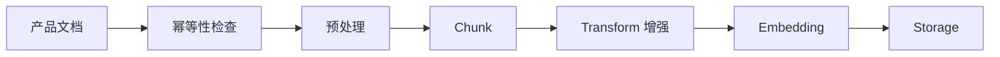
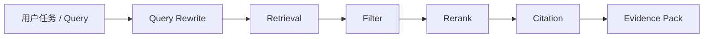
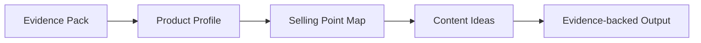

# 架构说明

## 系统形态

当前阶段实现为一个单体 Next.js TypeScript 应用，使用 Route Handlers 提供 REST APIs。RAG 主存储采用 PostgreSQL + pgvector；应用层保留 provider adapter 和 vector store adapter 边界，方便后续扩展模型 provider、rerank provider 和评估能力。

推荐技术栈：

- Next.js App Router
- TypeScript
- Tailwind CSS
- shadcn/ui 或等价的本地组件基座
- `app/api` 下的 Route Handlers
- PostgreSQL + pgvector
- Drizzle ORM 或等价 schema 管理方案
- Provider 抽象：OpenAI、Hugging Face TEI、Hugging Face Transformers.js、debug deterministic embedding

## UI 布局

Playground 的首屏应该就是实际工具：

- 顶部或左上：Document Library，支持上传文档、刷新已上传列表、选择 document version。
- 左侧：pipeline steps 和运行状态。
- 中间：当前 step 的 method selector 和 params editor。
- 右侧：output preview、evidence、trace、timing 和 errors。

当前阶段不做营销 landing page。这个应用首先是一个 workbench。

## RAG Ingestion Pipeline



每一步返回 trace envelope：

```json
{
  "step": "chunk",
  "method": "fixed-size",
  "params": {},
  "inputRef": "",
  "output": {},
  "trace": {
    "status": "success",
    "startedAt": "",
    "endedAt": "",
    "durationMs": 0,
    "warnings": [],
    "error": null
  }
}
```

更细的 stage 执行和 Playground 功能拆分见 `docs/RAG_PIPELINE_PLAYGROUND.md`。实现时不要一次性把整条 pipeline 做成黑盒按钮，而是按 stage 逐步添加 API、配置表单、run 状态、output preview 和 trace。

## Retrieval Pipeline



当前阶段 retrieval 字段：

- query
- rewritten queries
- topK
- threshold
- matched chunks
- score
- sourceRef
- retrieval trace
- rewrite/rerank provider trace

## Marketing Generation Pipeline



生成阶段不能编造没有证据支持的声明。每个 profile claim、selling point 和 content idea 都应尽量包含 `evidenceChunkIds`。如果 evidence 不足，返回低 confidence 或 warning。

## 存储模型

当前阶段以 PostgreSQL + pgvector 为主存储。需要保留清晰 adapter 边界，避免 API、UI 和具体数据库查询强耦合。

核心实体：

- Document：id、fileName、latestVersionId、createdAt、updatedAt、lastSelectedAt。
- DocumentVersion：id、documentId、version、fileHash、fileSize、mimeType、sourceType、rawText/rawObjectRef、metadata、processingStatus。
- Chunk：id、documentId、documentVersionId、text、enhancedText、metadata、sourceRef。
- Embedding：chunkId、model、dimension、vector。
- ProviderConfig：provider、model、modelSource、dimension、runtimeConfig。
- PipelineRun：id、status、currentStage、createdAt、updatedAt。
- StepRun：id、pipelineRunId、stage、method、params、inputRef、outputRef、status、durationMs、warnings、error。
- RetrievalRun：id、query、params、matches、trace。
- MarketingArtifact：id、type、inputRefs、output、evidenceChunkIds。

## 范围边界

阶段 1 完成前不要引入多用户概念。模型 provider 要放在接口后面；用户选择的 provider 不可静默 fallback。缺少 API key、本地模型或 TEI 服务不可用时，返回明确错误码并写入 trace。
