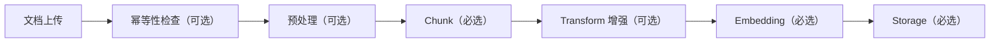
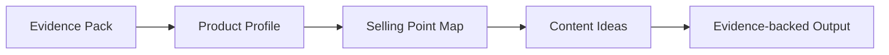

# 架构说明

## 系统形态

当前阶段实现为一个单体 Next.js TypeScript 应用，使用 Route Handlers 提供 REST APIs。RAG 主存储采用 PostgreSQL + pgvector；应用层保留 provider adapter 和 vector store adapter 边界，方便后续扩展模型 provider、rerank provider 和评估能力。

技术栈（已实现）：

- Next.js 16 App Router
- TypeScript + Tailwind v4
- 自写组件基座（未引入 shadcn/ui，避免 Tailwind v4 兼容问题）
- `app/app/api` 下的 Route Handlers（路径前缀 `/api/pipeline/*`）
- 本地 JSON 存储（`app/data/documents.json`）—— **当前 dev 阶段**，后续替换为 PostgreSQL
- pdf-parse v1 + mammoth + turndown（文档解析）
- Python FastAPI 微服务（`services/pymupdf/`）—— 提供 pymupdf PDF 精确提取
- `openai` SDK + `@huggingface/transformers`（embedding provider）
- `pg` + `pgvector`（向量存储，Storage Stage API route 已实现；需 `DATABASE_URL` env）

待引入（后续阶段）：
- Drizzle ORM（生产阶段替换直接 SQL 查询）
- 完整 Retrieval / Generation pipeline routes（feat-004.x / feat-005）

## UI 布局

Playground 的首屏应该就是实际工具：

- 顶部或左上：Document Library，支持上传文档、刷新已上传列表、选择 document version。
- 左侧：pipeline steps 和运行状态。
- 中间：当前 step 的 method selector 和 params editor。
- 右侧：output preview、evidence、trace、timing 和 errors。

当前阶段不做营销 landing page。这个应用首先是一个 workbench。

## RAG Ingestion Pipeline



> 括号内为步骤分类（详见 `docs/ORCHESTRATION.md`）。可选步骤被禁用时，下游自动向上查找最近活跃步骤的 output。

每一步返回 trace envelope：

```json
{
  "step": "chunk",
  "method": "fixed-size",
  "params": {},
  "inputRef": "",
  "output": {},
  "trace": {
    "status": "success",
    "startedAt": "",
    "endedAt": "",
    "durationMs": 0,
    "warnings": [],
    "error": null
  }
}
```

更细的 stage 执行和 Playground 功能拆分见 `docs/RAG_PIPELINE_PLAYGROUND.md`。实现时不要一次性把整条 pipeline 做成黑盒按钮，而是按 stage 逐步添加 API、配置表单、run 状态、output preview 和 trace。

## Retrieval Pipeline


> 完整步骤分类和可配置编排方案见 `docs/ORCHESTRATION.md`（feat-003.7）。

当前阶段 retrieval 字段：

- query
- rewritten queries
- topK
- threshold
- matched chunks
- score
- sourceRef
- retrieval trace
- rewrite/rerank provider trace

## Marketing Generation Pipeline



生成阶段不能编造没有证据支持的声明。每个 profile claim、selling point 和 content idea 都应尽量包含 `evidenceChunkIds`。如果 evidence 不足，返回低 confidence 或 warning。

## 存储模型

**文档存储（当前 dev 阶段）**：`app/data/documents.json` 本地 JSON 文件。
所有读写通过 `app/lib/docStore.ts` 封装（Repository Pattern），迁移到 PostgreSQL 只需替换内部实现。
二进制文件（PDF/DOCX）以 base64 存储（`isBinary: true`）；迁移后改用 `BYTEA` 类型，接口不变。

**向量存储（已实现）**：PostgreSQL + pgvector。
Storage Stage API route（`/api/pipeline/storage`）已实现；自动 DDL 初始化 `rag_documents`/`rag_chunks` 表，含 UNIQUE 约束和可选 HNSW/IVFFlat 索引。
需要环境变量 `DATABASE_URL`（或在表单中临时填写连接串）。

**生产阶段目标**：Drizzle ORM 管理 schema，替换直接 pg 查询；保留清晰 adapter 边界。

核心实体：

- Document：id、fileName、latestVersionId、createdAt、updatedAt、lastSelectedAt。
- DocumentVersion：id、documentId、version、fileHash、fileSize、mimeType、sourceType、rawText/rawObjectRef、metadata、processingStatus。
- Chunk：id、documentId、documentVersionId、text、enhancedText、metadata、sourceRef。
- Embedding：chunkId、model、dimension、vector。
- ProviderConfig：provider、model、modelSource、dimension、runtimeConfig。
- PipelineRun：id、status、currentStage、createdAt、updatedAt。
- StepRun：id、pipelineRunId、stage、method、params、inputRef、outputRef、status、durationMs、warnings、error。
- RetrievalRun：id、query、params、matches、trace。
- MarketingArtifact：id、type、inputRefs、output、evidenceChunkIds。

## 横向关注点架构决策

以下四类能力属于"横切关注点"，不作为 Pipeline 步骤实现，在此记录显式决策，防止后续 agent 引入不必要的复杂度。

### 可观测性

**决策**：已通过 trace envelope 满足，不引入额外监控基础设施。

每个 stage API 返回 `durationMs / warnings / trace / error`，前端 `StepRun` 完整记录历史运行结果。这已覆盖"每个步骤的耗时、输入输出大小、成功率、错误日志"的核心需求。OpenTelemetry / Prometheus / Grafana 属于生产级监控，超出当前阶段边界。

如需跨次运行聚合指标（平均耗时、成功率），在 feat-006 (RAG Quality Evaluation) 里用已有的 `stepRuns` 数据计算即可，无需引入新基础设施。

### Embedding 缓存

**决策**：等 pgvector 实测通过后，在 embedding route 里增加 "skip-if-already-embedded" 逻辑，不引入独立缓存服务。

实现思路：embedding 阶段调 API 前，先查 `rag_chunks` 表中是否已有相同 `(document_id, chunk_index, embedding_dimension)` 的记录；命中则跳过 API 调用，直接复用已有向量。成本：3-5 行 SQL，无新依赖。

LLM 生成缓存在当前阶段无明显收益，不实现。

### 安全合规（PII 脱敏、权限过滤）

**决策**：阶段 4（真实存储、协作与产品化）之前不实现 ACL 和 PII 处理。

当前场景是单用户本地工具，文档内容视为对使用者完全可见，retrieval 结果不做权限裁剪。引入 workspace / 多用户概念时再同步引入 ACL 过滤层（检索后、生成前）和 PII 脱敏层（文档上传后、分块前）。

### 离线评估

**决策**：作为 feat-006 实现，是阶段 1 闭环的必要组成部分，不可跳过。

实现范围：golden dataset 管理（query + expectedChunkIds）、Hit Rate@K、MRR 指标计算、不同 pipeline 配置的对比视图。不依赖 RAGAS（Python 重依赖），用 TypeScript 实现核心指标，读取现有 `stepRuns` 数据，无需重跑 pipeline。

---

## 范围边界

阶段 1 完成前不要引入多用户概念。模型 provider 要放在接口后面；用户选择的 provider 不可静默 fallback。缺少 API key、本地模型或 TEI 服务不可用时，返回明确错误码并写入 trace。
