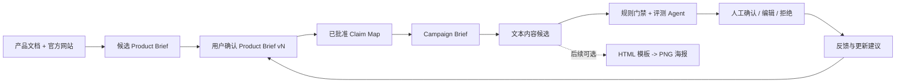
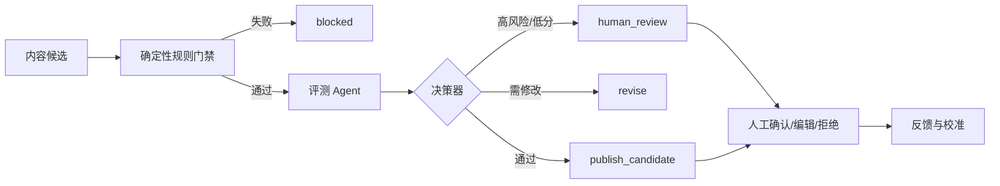

# Product Brief 产品迭代方案

## 1. 决策摘要

本计划取代旧 Phase 4 只围绕“四列 Studio + Content Ideas”的规划。产品的第一个完整交付不再是若干未经验证的卖点或文案，而是：

> 独立开发者导入产品资料与官方网站后，确认一份可追溯的 Product Brief；系统只使用已确认主张生成内容，并通过评测与人工筛选交付可发布候选。

首个付费场景是**独立开发者或 2-5 人产品团队的产品发布 / 功能更新素材包**。首批用户不上传敏感企业资料；输入限定为用户主动提交的产品文档和公开官方网站内容。

本计划的优先级：

1. Product Brief 与事实确认。
2. 主张评测、人工筛选和反馈学习。
3. 可比较的内容包与平台工作流。
4. HTML 模板渲染 PNG 海报。

HTML 海报是增强能力，不得阻塞 Product Brief、评测与学习闭环的验证。

### 1.1 阶段 0/1 Agent Grounding 落地状态（2026-07-15）

阶段 0 和阶段 1 已实现为统一的服务端 `AgentGroundingContext`：

```text
Confirmed Product Brief fields（事实裁决）
  + Approved Claims（允许的发布表达）
  + field/claim evidence chunk IDs（追溯依据）
  + enabled platform rules（发布硬约束）
  -> outer Agent / generate / refine / critic 共用同一对象
  -> 确定性门禁
  -> 最近一次 critic passed 的精确 draft 才可交付
```

实现边界：

- 没有整体 confirmed Brief 或没有 confirmed 字段时，生成、修订、评测均不调用 nested LLM，返回 `insufficient_context`。
- `candidate`、`stale`、`rejected` 字段和 `auto_generations` 摘要不进入事实输入。
- raw RAG chunk 只在服务端用于 provenance/audit，不把原文注入生成模型；同一 chunk 可能同时包含未确认事实，不能借 evidence 绕过 Brief。
- 生成与修订后由代码检查有效 citation、无依据价格/规格数字和平台规则；失败不能被 critic 高分覆盖。
- 仅禁词失败时可做“删除配置禁词”的确定性归一化，删除项进入 tool result；其他规则失败继续阻止。
- critic 使用 JSON 结构化模式兼容 GLM；`passed=true` 后清空建议，并由 runtime 交付被评审的精确 draft，防止 outer Agent 转述时删除引用或改写事实。

评测注意：旧通用 golden（护肤品、节日、环保包装等）不能直接用于任意项目级 Brief，否则正确的拒答会被旧 reference 判低分。Grounding 回归必须使用与被测 Confirmed Brief 对齐的 case，当前样例为 `gold-product-brief-grounding-006`。

## 2. 产品闭环



### 2.1 首期用户任务

用户完成一次产品发布任务后，应获得：

- 一份已确认的 Product Brief。
- 三个针对目标用户与场景的传播角度。
- 每个角度的一组文本内容候选及其主张来源。
- 每条候选的评测结论：可发布候选、需人工复核、需修改或阻止。
- 对已发布或编辑内容的反馈记录，供下一次生成使用。

首期不承诺自动发布，不将模型输出表述为事实，也不将单次用户编辑自动固化为长期偏好。

## 3. Product Brief

### 3.1 定义

Product Brief 是项目级、可编辑、可版本化的产品表达资产。它不等于一段摘要，而是有来源、证据、置信度和确认状态的字段集合。

| 字段组 | 包含内容 | 默认来源 | 是否可作为事实依据 |
| --- | --- | --- | --- |
| 产品身份 | 名称、官网、类别、一句话定位 | 用户、文档、官网 | 是，须确认 |
| 产品事实 | 功能、支持范围、限制、价格、版本 | 产品文档、官方页面 | 是，须 evidence 或确认 |
| 用户与场景 | 目标用户、问题、使用时机、替代方案 | 文档、用户补充 | 是，须确认 |
| 定位与差异化 | 核心价值、对比角度、不可宣称事项 | 用户、文档、竞品资料 | 部分；区分事实与表达 |
| 表达约束 | 语气、常用词、禁用词、CTA 风格 | 用户、历史内容、编辑反馈 | 否，用于内容表达 |
| 视觉系统 | Logo、颜色、字体、产品截图、模板偏好 | 用户补充上传 | 否，用于后续海报 |
| 内容记忆 | 已发布内容、角度、平台、人工结论、结果 | 用户提交、系统记录 | 否，用于排序与建议 |
| 平台约束 | 长度、标签、敏感词、合规要求 | 用户设置 | 否，为硬性生成约束 |

### 3.2 字段通用结构

```ts
type BriefField = {
  id: string;
  group: "identity" | "fact" | "audience" | "positioning" | "style" | "visual" | "constraint";
  key: string;
  value: unknown;
  source: "document" | "website" | "user" | "historical_content" | "inferred";
  evidenceChunkIds: string[];
  confidence: number;
  status: "candidate" | "confirmed" | "rejected" | "stale";
  version: number;
};
```

规则：

- `fact` 没有 evidence 或用户确认时不得进入正式 Claim。
- 来自历史内容的字段只能提出表达建议，不能证明产品功能。
- 用户编辑事实字段时必须记录原因和新版本。
- 一次官网同步或文档更新只能把字段标为 `stale` 或生成候选更新，不能自动覆盖已确认内容。

### 3.3 Product Brief 创建流程

```text
创建项目
  -> 上传产品资料
  -> 填写官方域名（可选）
  -> 执行文档处理与官网导入
  -> 分字段提取候选值与 evidence
  -> 检测缺失与矛盾
  -> 用户确认 / 编辑 / 拒绝
  -> 保存 Product Brief v1
```

前端必须使用审核工作台，而不是直接显示模型总结：

- 按字段组显示候选值、来源原文、置信度和状态。
- 支持确认、编辑、拒绝、标记待补充。
- 显示“未确认关键字段”和“存在矛盾字段”。
- 显示版本差异及内容使用的 Brief 版本。

### 3.4 官网导入

官网导入是受限的官方来源连接器，不是通用网络爬虫。

允许范围：

- 用户主动提交域名并确认有权使用。
- 同域名内的首页、产品页、定价页、FAQ、帮助中心和更新日志。
- 读取 `robots.txt`、sitemap、HTML 正文、标题、meta、Open Graph 和 JSON-LD。
- 设置最大页面数、最大深度、限速和路径白名单。

禁止范围：

- 不登录、不绕过权限、不抓取私有页面。
- 不抓取社交平台；历史社交内容只接受用户粘贴或导出的内容文件。
- 不把网页变更自动写入已确认的 Product Brief。

来源表建议：

```text
source_records          # 项目提交的文档 / 域名 / 手工内容
source_snapshots        # 不可变原始快照与 hash
source_pages            # URL、标题、类型、抓取时间、状态
source_content_chunks   # 清洗文本与 source snapshot 引用
source_sync_jobs        # 官网导入和用户触发的同步任务
```

官网页面中的功能、价格和兼容性是候选事实；页面 slogan、CTA 和语气是表达线索，二者不得混淆。

### 3.5 视觉资产后置补充

用户完成 Product Brief 后再补充视觉资产。未上传视觉资产不能阻塞 Brief、文本内容、评测或反馈学习。

用户需要海报时，系统再引导上传 Logo、产品截图、参考海报、品牌色和字体。视觉资产独立保存，不能被当作产品事实。

```ts
type VisualAsset = {
  id: string;
  projectId: string;
  kind: "logo" | "product_screenshot" | "reference_poster" | "font";
  fileRef: string;
  hash: string;
  width?: number;
  height?: number;
  label?: string;
  status: "uploaded" | "approved" | "archived";
  allowedTemplateIds?: string[];
};
```

## 4. Claim Map 与内容生成

### 4.1 Claim Map

生成内容前先建立主张库。主张不是修辞句，而是可被审核的传播单元。

```ts
type Claim = {
  id: string;
  text: string;
  claimType: "functional" | "outcome" | "differentiation" | "emotional";
  targetAudienceIds: string[];
  scenarioIds: string[];
  evidenceChunkIds: string[];
  riskLevel: "low" | "medium" | "high";
  status: "candidate" | "approved" | "blocked";
};
```

事实型主张必须有 evidence；表达型主张必须清楚标示为角度而不是客观承诺。主张审批后才可被下游内容使用。

### 4.2 Campaign Brief

每次生成前用户选择本次传播任务：

- 目标：产品发布、功能更新、获客测试或官网表达梳理。
- 目标用户与使用场景。
- 平台、格式和长度。
- CTA。
- 可使用的已批准主张。
- 需要避免的角度和表达。

系统输出结构化 `ContentVariant`，而不是难以评测的自由文本：

```ts
type ContentVariant = {
  id: string;
  angle: string;
  targetAudience: string;
  hook: string;
  body: string;
  cta: string;
  claimIds: string[];
  briefVersionId: string;
};
```

## 5. 评测方案

### 5.1 目标

评测不是单个打分模型，而是决定内容能否进入人工环节的质量门禁。它必须可解释、可回归、可校准。

评测对象：

| 对象 | 核心问题 |
| --- | --- |
| Product Brief | 是否完整、准确、可追溯、无矛盾 |
| Claim | 是否被证据支持、是否过度承诺、是否重复 |
| Content Variant | 是否忠实、适合受众、适合平台、符合表达约束 |
| Agent 运行 | 是否用合理成本与步骤得到有效结果 |
| 海报 | 是否布局正确、文字可读、资产合法 |

### 5.2 运行时流程



### 5.3 确定性规则门禁

以下检查不得依赖模型评分：

- 内容中的每条产品主张是否引用已批准 Claim。
- Claim 是否仍有有效 evidence。
- 数字、日期、价格、兼容性等硬事实是否与 evidence 一致。
- 是否使用被禁止、拒绝或过期的 Brief 字段。
- 是否违反平台字数、标签、CTA、敏感词或合规规则。
- 是否存在重复主张堆叠。

任一事实门禁失败即 `blocked`。评测 Agent 的高分不能覆盖事实门禁。

### 5.4 评测 Agent

评测 Agent 只接收受限上下文：

```text
Campaign Brief
已确认的 Product Brief 字段
内容使用的 Claim 与 evidence 摘要
待评测内容
平台与表达约束
```

它不得访问未筛选的全部文档，不得补充外部事实。输出由 Zod 校验：

```ts
type ContentEvaluation = {
  factualFaithfulness: 1 | 2 | 3 | 4 | 5;
  audienceFit: 1 | 2 | 3 | 4 | 5;
  platformFit: 1 | 2 | 3 | 4 | 5;
  clarity: 1 | 2 | 3 | 4 | 5;
  differentiation: 1 | 2 | 3 | 4 | 5;
  styleFit: 1 | 2 | 3 | 4 | 5;
  issues: Array<{
    severity: "blocker" | "warning" | "suggestion";
    category: string;
    evidence?: string;
    recommendation: string;
  }>;
  decision: "publish_candidate" | "human_review" | "revise" | "blocked";
};
```

决策规则：

```text
事实门禁失败                         -> blocked
评测发现 blocker                     -> revise
关键维度低分或评测不确定              -> human_review
全部关键维度达标且无高风险             -> publish_candidate
```

`publish_candidate` 表示可供用户发布，不表示系统自动发布。

### 5.5 离线评测、版本与校准

建立至少两套数据：

- 开发集：20 份真实或脱敏产品资料，含人工确认字段、可接受/不可接受 Claim 与内容样例。
- 保留集：10 份不参与 prompt 调整的样本，用于回归验证。

每次改 Product Brief 提取、Claim 生成、内容生成、评测 prompt、规则或模板，都要记录：输入版本、Prompt 版本、模型版本、结果和指标。

指标：

| 层级 | 指标 |
| --- | --- |
| Brief | 关键字段 evidence coverage、人工事实正确率、矛盾漏检率 |
| Claim | 可证明主张比例、错误主张漏放率、重复率 |
| Content | 人工接受率、人工修改率、事实问题率、评测-人工一致率 |
| Feedback | 用户接受更新建议比例、更新前后修改率变化 |
| Agent | 成功率、成本、步骤数、fallback 率 |
| 海报 | 布局失败率、人工重排率、导出成功率 |

每轮抽样 10-20 条内容由人工标注，用来识别两类最重要误差：系统放行但人工拒绝，以及系统阻止但人工认可。前者优先修复，后者用于降低摩擦。

## 6. 人工筛选与反馈学习

### 6.1 人工操作

人工不应逐字审核所有输出，只处理：

- Product Brief 的关键事实与冲突。
- 新 Claim 的批准或阻止。
- `human_review` 队列的高风险内容。
- 对表达偏好、模板偏好和推荐角度的更新建议。

### 6.2 反馈数据

除评分外，记录采用、编辑后采用、拒绝、人工补充事实、人工标记错误事实及发布后基础结果。编辑差异先分类为有限类别：

```text
语气太夸张 / 太技术化 / 太冗长 / 缺少具体场景 /
CTA 不自然 / 主张不准确 / 平台语感不对
```

系统只生成更新建议，例如“最近 4 次编辑都删除夸张词，建议新增禁用表达”。用户接受后才写入 Product Brief 的表达约束。任何单次编辑和任何用户反馈都不得自动改写产品事实。

## 7. 技术实现与模块边界

新增 NestJS 模块：

```text
product-brief/        # Brief CRUD、版本、字段审核、提取
sources/              # 文档与受限官网来源快照、导入任务
claims/               # Claim Map 与 evidence 校验
campaigns/            # Campaign Brief、内容包与版本
content-evaluation/   # 规则门禁、评测 Agent、决策器、离线评测
feedback-learning/    # 编辑差异、分类、更新建议、接受记录
assets/               # 后续视觉资产与模板权限
renderer/             # 最后接入 HTML -> PNG
```

实现原则：

- 调用模型统一走 `LlmService`，结构化输出统一用 Zod 校验。
- `Product Brief -> Claim -> Content -> Evaluation` 各步骤独立落库，所有模型调用、证据和决策可回放。
- 初期使用显式服务编排；不要让 ReAct Agent 自由决定事实提取和审批顺序。
- ReAct Agent 在评测闭环稳定后，才用于选择重试、推荐角度和调用评测，不得绕过事实门禁。
- 官网导入使用受限 fetch/parser 任务；动态页面仅在必要时用受控浏览器渲染，禁止通用网页搜索与社交抓取。
- 海报阶段用受限模板 DSL + React/HTML/CSS + Playwright Chromium 截图；Agent 不得直接产出任意 HTML/CSS。

## 8. Feature 执行顺序

| Feature | 目标 | 依赖 | 完成定义 |
| --- | --- | --- | --- |
| feat-400.1 | 用户试点、Product Brief v1、文档与受限官网导入 | feat-300.7 | 用户确认 Brief v1；关键事实全可追溯；官网快照可回放 |
| feat-400.2 | Claim Map、规则门禁、评测 Agent、人工队列 | feat-400.1 | 内容不绕过 Claim；评测输出与决策可回放；有保留集回归 |
| feat-400.3 | 反馈学习与更新建议 | feat-400.2 | 编辑/拒绝可分类；偏好更新需用户批准；可测修改率变化 |
| feat-400.4 | Campaign 内容包与平台工作流 | feat-400.3 | 生成 3 个可比较角度；支持局部重生成和历史比较 |
| feat-400.5 | 视觉资产、受限模板、HTML 到 PNG | feat-400.4 | 导出海报无溢出；只使用批准资产和 Claim |

安全前提：在跨用户访问控制、BYOK 加密和数据隔离完成前，试点仅接收用户主动提供的公开资料；不得宣传企业级私有资料托管能力。

## 9. 非目标

- 不做社交平台通用爬虫。
- 不做自动发布。
- 不做任意 HTML/CSS 或自由生成品牌图片。
- 不将模型推断、历史文案或反馈视为产品事实。
- 不以 Agent 工具调用轨迹代替产品质量评测。
